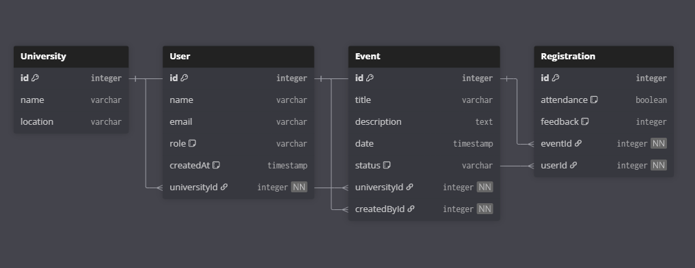

# Campus Event Organizer 

## Getting Started
The techstack

| Layer        | Technology                 | Purpose                                                                 |
|--------------|----------------------------|-------------------------------------------------------------------------|
| **Frontend** | [Next.js (App Router)](https://nextjs.org/) | React framework for server-side rendering, routing, and client interactivity |
|              | [Tailwind CSS](https://tailwindcss.com/)    | Utility-first CSS framework for styling and responsive design           |
| **Backend**  | [Next.js API Routes](https://nextjs.org/docs/app/building-your-application/routing/router-handlers) | Server-side API endpoints inside the Next.js app |
| **Database** | [SQLite](https://www.sqlite.org/)           | Lightweight relational database (file-based, great for prototyping/dev) |
| **ORM**      | [Prisma](https://www.prisma.io/)            | Type-safe ORM for database modeling and querying                        |
| **Runtime**  | [Node.js](https://nodejs.org/)              | JavaScript runtime for executing the Next.js app                        |
| **Package Manager** | [npm](https://www.npmjs.com/) | Dependency management and scripts |

---

## How to start (Two methods)
1. Download the codebase ```(.zip)```, extract and open the **event_management** folder.
### OR
2. Clone the repo to your local dev environment and open it.
- Open ```powershell/cmd prompt```
- Execute 
```bash
npm i
```
_**Note:** Make sure you are in the same directory as ```package.json```_
- Type 
```bash
npm run dev
# First compile will be slow, look for compiling / in the console
```
- Open browser and go to URL <a href="https://localhost:3000/">https://localhost:3000/</a>

_**Note:** The project can be locally hosted as it is using SQLite which doesn't go well with vercel hosting, for hosting it on vercel or any other service we'll have to switch to postgreSQL or a similar alternative._
<br>

_**Note:** As it is SQLite the data is passed with the codebase, so there are no concerns about hosting database either (prevents clever-cloud or mongodb compass response delay)._

## DB Approach


1. The approach was quite straight forward, with main goal to have one user to belong to atleast one university, and by default they will create events for that university
2. university --> user (1-n) --> events (1-n) --> registrations (1-n)
3. user --> registration (1-1)

Refer to DB setup [here](prisma/DB.md) or check out the ```/prisma``` folder

## API & CRUD
Very basic api routes are used for creating users, events etc.
Below code snippet shows **GET**, **POST** methods for users model.
```ts
//src/app/api/users/route.ts
import prisma from "@/lib/prisma";
import { NextResponse } from "next/server";

// GET /api/users
export async function GET() {
    const users = await prisma.user.findMany()
    return NextResponse.json(users)
}

// POST /api/users
export async function POST(req: Request){
    const body = await req.json()
    const user = await prisma.user.create({data:body})
    return NextResponse.json(user, {status: 201})
}
```
_**Note:** prisma here refers to the ```PrismaClient``` for quering during dev._

